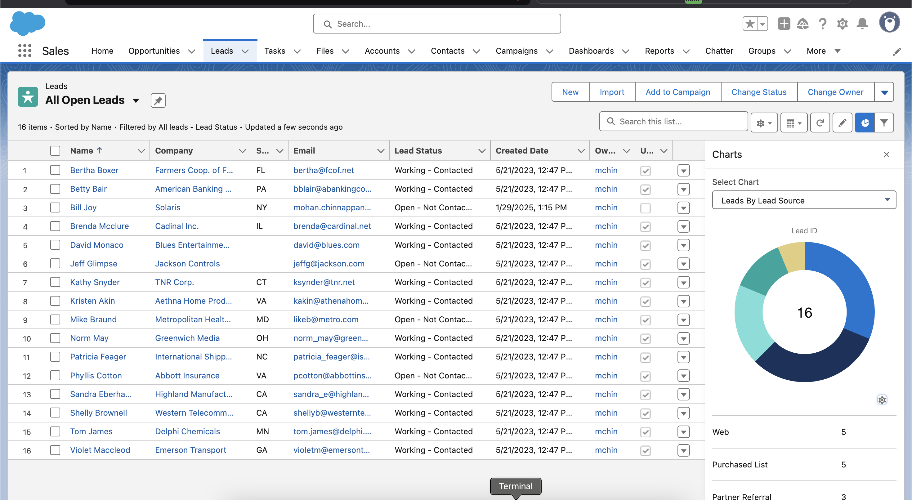

# Salesforce List View Best Practices Whitepaper

[Podcast](https://mohan-chinnappan-n5.github.io/webm/player2.html?v=https://raw.githubusercontent.com/mohan-chinnappan-n5/whitepapers/main/list-views/list-views-podcast.wav.webm)

## Introduction
Salesforce list views are powerful tools that allow users to filter, display, and manage records efficiently within the platform. When used effectively, list views can streamline workflows, enhance visibility into critical data, and improve collaboration across teams. This whitepaper provides best practices for creating, managing, and utilizing list views to maximize their potential in Salesforce.

---

## What Are Salesforce List Views?
List views are customizable displays of records in Salesforce objects (e.g., Accounts, Contacts, Opportunities) that allow users to apply filters, sort data, and share views with others. They are accessible from object tabs and can be tailored to meet specific business needs.

---

## Best Practices for Salesforce List Views

### 1. Define Clear Objectives for Each List View
- **Why It Matters**: A well-defined purpose ensures the list view delivers actionable insights.
- **How to Implement**:
  - Identify the specific use case (e.g., "Open Opportunities Closing This Month," "Overdue Tasks").
  - Avoid generic or overly broad list views that dilute focus.
- **Example**: Create a list view for "High-Priority Leads" with filters like Lead Score > 80 and Status = Open.

### 2. Optimize Filters for Precision
- **Why It Matters**: Filters determine the relevance of the data displayed. Overly broad or narrow filters can reduce usability.
- **How to Implement**:
  - Use specific criteria (e.g., date ranges, owner names, status values).
  - Leverage dynamic filters like "My Records" or "My Team’s Records" to personalize views.
  - Test filters to ensure they return the expected results.
- **Tip**: Use the "AND" and "OR" logic thoughtfully to balance inclusivity and specificity.

### 3. Select Relevant Columns
- **Why It Matters**: Displaying too many or irrelevant columns can overwhelm users and obscure key information.
- **How to Implement**:
  - Limit columns to 5-10 key fields that align with the list view’s purpose.
  - Include fields like record name, status, owner, and key dates.
  - Avoid redundancy (e.g., don’t include both "Created Date" and "Last Modified Date" unless necessary).
- **Example**: For a "Closed Won Opportunities" list view, include Opportunity Name, Amount, Close Date, and Owner.

### 4. Leverage Sorting and Grouping
- **Why It Matters**: Proper sorting improves readability and helps users prioritize tasks.
- **How to Implement**:
  - Set a default sort order (e.g., descending by Close Date for Opportunities).
  - Use inline editing to allow quick updates directly from the list view.
  - Enable grouping (available in Lightning Experience) for hierarchical views (e.g., group by Stage).
- **Tip**: Combine sorting with filters for maximum efficiency (e.g., sort overdue tasks by due date).

### 5. Share List Views Strategically
- **Why It Matters**: Sharing enhances collaboration but can clutter the system if overused.
- **How to Implement**:
  - Share with specific users, roles, or groups rather than "All Users" unless broadly applicable.
  - Use "Public Groups" for team-based sharing to simplify administration.
  - Regularly review shared list views to remove outdated ones.
- **Example**: Share a "Regional Sales Pipeline" list view with the Sales Team public group.

### 6. Use Naming Conventions
- **Why It Matters**: Consistent naming improves discoverability and reduces confusion.
- **How to Implement**:
  - Adopt a standard format (e.g., [Team] - [Purpose] - [Scope]).
  - Keep names concise yet descriptive.
  - Avoid special characters or excessive abbreviations.
- **Example**: "Sales - Open Opps - This Quarter" or "Support - Escalated Cases - Today."

### 7. Incorporate Charts and Visualizations
- **Why It Matters**: Visual summaries provide quick insights without leaving the list view.
- **How to Implement**:
  - Add a chart (e.g., bar chart for Opportunities by Stage) in Lightning Experience.
  - Ensure the chart aligns with the list view’s purpose.
  - Keep it simple—avoid overly complex visuals that confuse users.
- **Tip**: Use donut or funnel charts for pipeline-focused list views.

### 8. Maintain and Audit List Views
- **Why It Matters**: Over time, list views can become obsolete or cluttered, reducing efficiency.
- **How to Implement**:
  - Periodically review list views for relevance (e.g., quarterly audits).
  - Delete or archive unused views (requires admin permissions).
  - Solicit user feedback to refine existing views.
- **Tip**: Use the "Last Viewed Date" field (if tracked) to identify dormant list views.

### 9. Educate Users on Usage
- **Why It Matters**: Adoption drives value; users need to understand how to leverage list views.
- **How to Implement**:
  - Provide training on creating and customizing list views.
  - Share a cheat sheet of common filters and use cases.
  - Encourage users to clone and adapt shared list views for personal use.
- **Example**: Host a workshop on "Building Effective List Views" for your team.

### 10. Align with Security and Permissions
- **Why It Matters**: List views should respect Salesforce’s security model to prevent data exposure.
- **How to Implement**:
  - Ensure field-level security (FLS) and object permissions align with the list view’s visibility.
  - Test list views as different user profiles to confirm appropriate access.
  - Avoid exposing sensitive fields (e.g., Social Security Numbers) in columns.
- **Tip**: Admins should periodically validate sharing settings.

---

## Benefits of Following Best Practices
- **Improved Productivity**: Users can quickly access and act on relevant data.
- **Enhanced Collaboration**: Shared list views align teams on priorities.
- **Better Data Management**: Clean, purposeful list views reduce clutter and errors.
- **Scalability**: Standardized practices support growth and adoption across the organization.

---

## Conclusion
Salesforce list views are a cornerstone of efficient CRM usage, but their effectiveness depends on thoughtful design and management. By defining clear objectives, optimizing filters and columns, sharing strategically, and maintaining views over time, organizations can unlock their full potential. Implementing these best practices ensures that list views remain a valuable tool for driving insights, productivity, and success in Salesforce.

---

